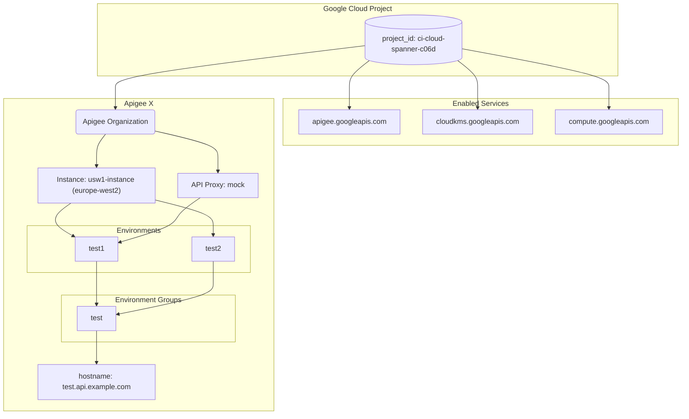

# Apigee X Terraform

This Terraform module sets up a basic Apigee X organization.

## Prerequisites

*   Terraform v1.0+
*   Google Cloud SDK
*   Authenticated as a user with permissions to create the resources described below.

## Usage

1.  **Initialize Terraform:**
    ```bash
    terraform init
    ```

2.  **Review the plan:**
    ```bash
    terraform plan
    ```

3.  **Apply the changes:**
    ```bash
    terraform apply
    ```

## Inputs

| Name | Description | Type | Default | Required |
| --- | --- | --- | --- | --- |
| `project_id` | Project id (also used for the Apigee Organization). | `string` | n/a | yes |
| `billing_account` | Billing account id. | `string` | `null` | no |
| `project_create` | Create project. When set to false, uses a data source to reference existing project. | `bool` | `false` | no |
| `project_parent` | Parent folder or organization in 'folders/folder\_id' or 'organizations/org\_id' format. | `string` | `null` | no |
| `ax_region` | GCP region for storing Apigee analytics data. | `string` | n/a | yes |
| `apigee_instances` | Apigee Instances (only one instance for EVAL orgs). | `map(object({ region = string, environments = list(string) }))` | `null` | no |
| `apigee_envgroups` | Apigee Environment Groups. | `map(object({ hostnames = list(string) }))` | `null` | no |
| `apigee_environments` | Apigee Environments. | `map(object({ display_name = optional(string), description = optional(string), node_config = optional(object({ min_node_count = optional(number), max_node_count = optional(number) })), iam = optional(map(list(string))), envgroups = list(string), type = optional(string) }))` | `null` | no |

## Outputs

No outputs are defined.

## Resource Diagram


