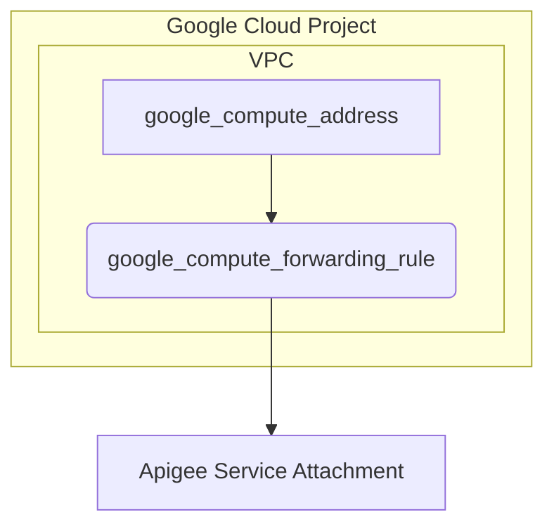

# Terraform Apigee PSC Endpoint

This Terraform module creates the necessary networking resources to establish a Private Service Connect (PSC) endpoint for Apigee.

## Architecture

The following diagram illustrates the resources created by this module:



## Usage

1.  **Clone the repository:**
    ```bash
    git clone https://github.com/your-repo/apigee-networking-sme.git
    cd 1_northbound/0_psc_endpoint
    ```

2.  **Update `terraform.tfvars`:**
    - `project_id`: Your Google Cloud project ID.
    - `vpc_name`: The name of the VPC to create.
    - `psc_subnets`: A list of subnets to create for the PSC endpoints.
    - `apigee_service_attachments`: A map of regions to Apigee service attachments.

3.  **Initialize and apply Terraform:**
    ```bash
    terraform init
    terraform apply
    ```

## Resources

-   **`google_project`**: Data source to get project details.
-   **`module "vpc"`**: Creates a VPC using the `terraform-google-modules/cloud-foundation-fabric` module.
-   **`google_compute_address`**: Creates an internal IP address for each PSC subnet.
-   **`google_compute_forwarding_rule`**: Creates a forwarding rule to forward traffic from the internal IP address to the Apigee service attachment.

## Inputs

| Name | Description | Type | Default | Required |
|------|-------------|------|---------|:--------:|
| project_id | Project ID. | `string` | n/a | yes |
| vpc_name | Name of the VPC. | `string` | n/a | yes |
| psc_subnets | Subnets for psc endpoints | `list(object)` | `[]` | yes |
| apigee_service_attachments | Map of instance region -> instance PSC service attachment | `map(string)` | n/a | yes |

## Outputs

This module does not produce any outputs.
