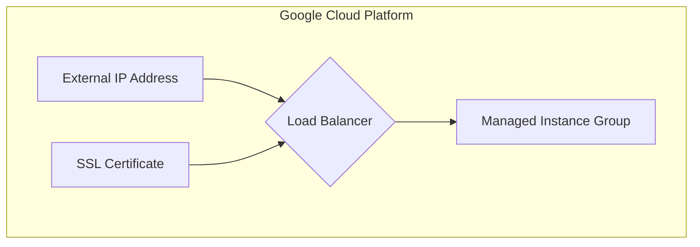

# Terraform Apigee Northbound Load Balancer

This Terraform code provisions a Layer 7 external load balancer for Apigee, routing traffic to a managed instance group.

## Resources

The following resources are created:

- **External IP Address:** A global external IP address for the load balancer.
- **Managed SSL Certificate:** A Google-managed SSL certificate for the load balancer's domain.
- **Layer 7 External Load Balancer:** The load balancer itself, configured with the managed instance group as a backend.

## Mermaid Diagram



## Usage

1. **Initialize Terraform:**
   ```bash
   terraform init
   ```

2. **Apply the configuration:**
   ```bash
   terraform apply
   ```

## Inputs

| Name | Description | Type | Default | Required |
|------|-------------|------|---------|:--------:|
| `project_id` | The ID of the Google Cloud project. | `string` | n/a | yes |
| `lb_name` | The name of the load balancer. | `string` | n/a | yes |
| `instance_group` | The managed instance group to use as a backend. | `string` | n/a | yes |

## Outputs

| Name | Description |
|------|-------------|
| `hostname` | The hostname of the load balancer. |
| `domains` | The domains configured for the SSL certificate. |
