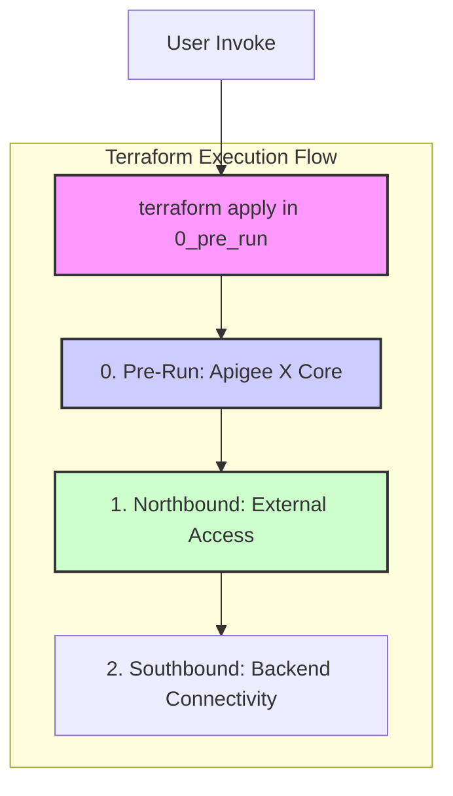

# Apigee Networking SME - Terraform Scenario Based Session

This repository contains Terraform code to demonstrate common networking patterns for Google Cloud Apigee X. The configurations are structured sequentially to build up a complete environment, from the core Apigee instance to northbound and southbound traffic management.

## Prerequisites

Before you begin, ensure you have the following installed and configured:
- [Terraform](https://learn.hashicorp.com/tutorials/terraform/install-cli) (v1.0 or later)
- [Google Cloud SDK (gcloud)](https://cloud.google.com/sdk/docs/install)
- An active Google Cloud project with billing enabled.
- Authenticated to gcloud with a user or service account having sufficient permissions (e.g., `roles/owner` or a combination of `roles/apigee.admin`, `roles/compute.admin`, `roles/iam.serviceAccountUser`).

## Execution Flow

The Terraform configurations are designed to be run in a specific order. Each numbered folder represents a distinct stage of the deployment. You must apply the configurations sequentially, starting from `0_pre_run`.



## Directory Structure

### `0_pre_run`
This directory lays the foundation for the environment. It uses the `apigee-x-core` module to provision:
- The core Apigee X instance.
- Required networking components (VPC, subnets).
- A sample API proxy for testing connectivity.

### `1_northbound`
This directory focuses on exposing the Apigee instance to external clients (northbound traffic). It is broken down into further sub-directories that must also be applied in order:
- **`0_psc_endpoint`**: Creates a Private Service Connect (PSC) endpoint to connect to the Apigee instance's service attachment.
- **`1_mig`**: Creates a Managed Instance Group (MIG) of proxy VMs that will forward traffic from the load balancer to the PSC endpoint.
- **`2_load_balancer`**: Creates a Global External HTTPS Load Balancer to expose the MIG to the internet.

### `2_southbound`
This directory is intended for configurations related to how Apigee connects to backend services (southbound traffic). Examples could include setting up VPC Peering, PSC for backends, or Cloud NAT for static egress IPs.
*(This section may be a placeholder for future patterns).*

### `modules`
This directory contains reusable Terraform modules that encapsulate best practices and reduce code duplication.
- **`apigee-x-core`**: A module for provisioning the core Apigee X instance and its immediate dependencies.
- **`mig-l7xlb`**: A module for creating the MIG and Load Balancer combination for northbound traffic.

## How to Use

1.  **Clone the repository:**
    ```sh
    git clone <repository_url>
    cd apigee-networking-sme
    ```

2.  **Configure and Apply Each Stage:**
    For each directory (`0_pre_run`, `1_northbound/0_psc_endpoint`, etc.), follow these steps:
    
    a. Navigate into the directory:
       ```sh
       cd 0_pre_run
       ```
    
    b. **(Important)** Create or modify the `terraform.tfvars` file to match your GCP project details and desired configuration.
    
    c. Initialize Terraform:
       ```sh
       terraform init
       ```
    
    d. Review the execution plan:
       ```sh
       terraform plan
       ```
    
    e. Apply the configuration:
       ```sh
       terraform apply
       ```

3.  **Proceed to the next directory in sequence.**

## Cleanup

To destroy the resources, run `terraform destroy` in each directory in the **reverse order** of creation.
1.  `2_southbound`
2.  `1_northbound/2_load_balancer`
3.  `1_northbound/1_mig`
4.  `1_northbound/0_psc_endpoint`
5.  `0_pre_run`
