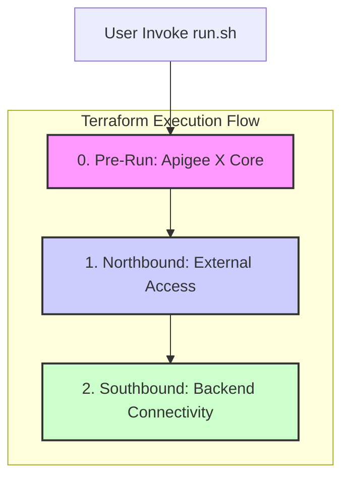

# Apigee Networking SME - Terraform Scenario Based Session

This repository contains Terraform code to demonstrate common networking patterns for Google Cloud Apigee X. The configurations are structured sequentially to build up a complete environment, from the core Apigee instance to northbound and southbound traffic management.

## Prerequisites

Before you begin, ensure you have the following installed and configured:
- [Terraform](https://learn.hashicorp.com/tutorials/terraform/install-cli) (v1.0 or later)
- [Google Cloud SDK (gcloud)](https://cloud.google.com/sdk/docs/install)
- An active Google Cloud project with billing enabled.
- Authenticated to gcloud with a user or service account having sufficient permissions (e.g., `roles/owner` or a combination of `roles/apigee.admin`, `roles/compute.admin`, `roles/iam.serviceAccountUser`).

## Execution Flow

The Terraform configurations are designed to be run in a specific order. Each numbered folder represents a distinct stage of the deployment. The included `run.sh` script automates this process, ensuring stages are applied or destroyed in the correct sequence.



## Directory Structure

### `0_pre_run`
This directory lays the foundation for the environment. It uses the `apigee-x-core` module to provision:
- The core Apigee X instance.
- Required networking components (VPC, subnets).
- A sample API proxy for testing connectivity.

### `1_northbound`
This directory focuses on exposing the Apigee instance to external clients (northbound traffic). It is broken down into further sub-directories that must also be applied in order:
- **`0_psc_endpoint`**: Creates a Private Service Connect (PSC) endpoint to connect to the Apigee instance's service attachment.
- **`1_mig`**: Creates a Managed Instance Group (MIG) of proxy VMs that will forward traffic from the load balancer to the PSC endpoint.
- **`2_load_balancer`**: Creates a Global External HTTPS Load Balancer to expose the MIG to the internet.

### `2_southbound`
This directory is intended for configurations related to how Apigee connects to backend services (southbound traffic).
- **`0_swp`**: Deploys a Secure Web Proxy instance.
- **`1_backend`**: Deploys a sample Nginx backend.

### `modules`
This directory contains reusable Terraform modules that encapsulate best practices and reduce code duplication.
- **`apigee-x-core`**: A module for provisioning the core Apigee X instance and its immediate dependencies.
- **`mig`**: A module for creating the MIG for northbound traffic.

## How to Use

The `run.sh` script is the recommended way to apply and destroy the infrastructure.

1.  **Clone the repository:**
    ```sh
    git clone <repository_url>
    cd apigee-networking-sme
    ```

2.  **Run the script:**
    The script requires your Google Cloud Project ID and the desired action (`--apply` or `--destroy`) and stage.

    **To apply all stages:**
    ```sh
    ./run.sh --project YOUR_PROJECT_ID --apply all
    ```

    **To apply a specific stage:**
    ```sh
    ./run.sh --project YOUR_PROJECT_ID --apply [prerun|psc|mig|ilb|swp|backend]
    ```

    For example, to only deploy the Apigee X instance:
    ```sh
    ./run.sh --project YOUR_PROJECT_ID --apply prerun
    ```

## Cleanup

To destroy the resources, use the `--destroy` flag with the `run.sh` script. You can destroy all resources or specific stages.

**To destroy all stages:**
```sh
./run.sh --project YOUR_PROJECT_ID --destroy all
```

**To destroy a specific stage:**
```sh
./run.sh --project YOUR_PROJECT_ID --destroy [ilb|mig|psc|prerun]
```
The script will handle the reverse order of destruction automatically.
