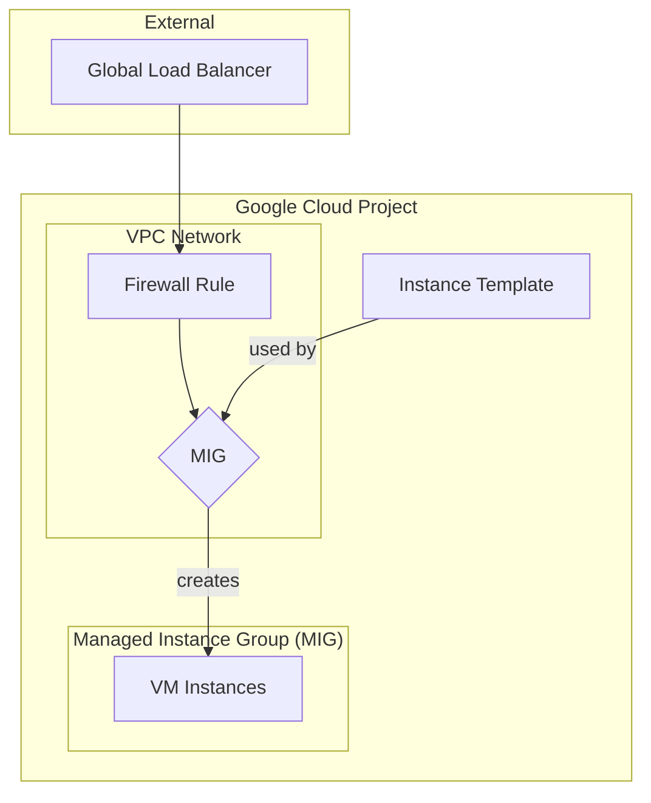

# Apigee Northbound MIG

This Terraform module creates a managed instance group (MIG) to act as a bridge for Apigee.

## Architecture

The following diagram illustrates the resources created by this module:

## Resources

This module creates the following resources:

- **Instance Template**: A template that defines the properties of the virtual machines in the MIG, including the machine type, network interfaces, boot disk, and a startup script to configure an Envoy proxy.
- **Managed Instance Group (MIG)**: A group of identical virtual machines that are managed as a single entity. The MIG is configured with autoscaling, named ports, and auto-healing policies.
- **Firewall Rule**: A firewall rule that allows traffic from Google Cloud's global load balancers to the MIG instances on port 443 for health checks.

## Usage

To use this module, you will need to provide values for the following variables:

- `project_id`: The ID of the Google Cloud project where the resources will be created.
- `region`: The region where the MIG will be located.
- `name`: The name of the MIG.
- `network`: The name of the VPC network where the MIG will be located.
- `subnet`: The name of the subnetwork where the MIG will be located.
- `machine_type`: The machine type of the virtual machines in the MIG.
- `target_size`: The target size of the MIG.
- `autoscaler_config`: The autoscaler configuration for the MIG.
- `network_tags`: A list of network tags to apply to the virtual machines in the MIG.
- `endpoint_ip`: The IP address of the Apigee endpoint.
